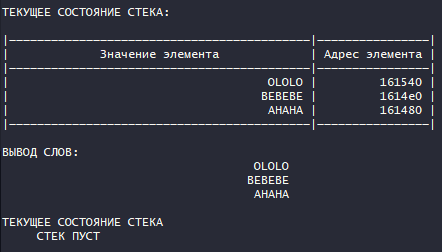
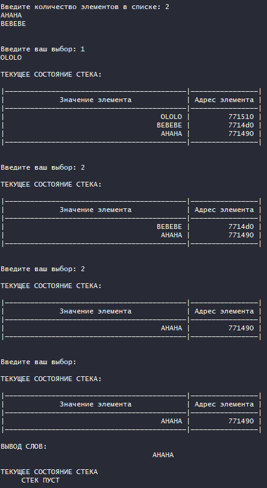
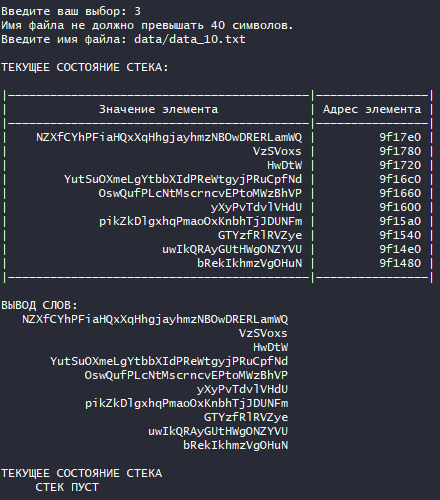
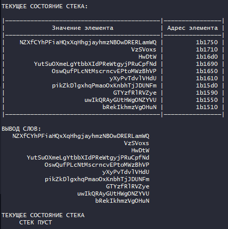
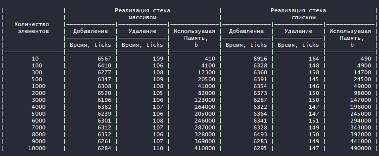

## Введение

### Условие задачи

Разработать программу работы со стеком, реализующую операции добавления и 
удаления элементов из стека и отображения текущего состояния стека. Реализовать 
стек: а) массивом; б) списком.

Элементами стека являются слова. Распечатайте слова в обратном порядке.

## Техническое задание

### Входные данные

Текстовый файл, номер команды из меню

### Выходные данные

Таблица замеров времени выполнения и используемой памяти; слова в обратном порядке

## Задачи, реализуемые программой

* Вывод слов в обратном порядке, используя в качестве стека массив
* Вывод слов в обратном порядке, используя в качестве стека список
* Сравнение эффективности разных способов реализации стека
* Добавление элемента в стек
* Удаление элемента из стека

## Способ обращения к программе

./app.exe

Выбор одного пункта меню:

* 0 - выход
* 1 - ввести данные (слова) вручную и вывести слова на экран, используя СПИСОК
  * 1 - добавить элемент в стек
  * 2 - удалить элемент из стека
  * 3 - вывести текущее состояние стека
* 2 - ввести данные (слова) вручную и вывести слова на экран, используя МАССИВ
  * 1 - добавить элемент в стек
  * 2 - удалить элемент из стека
  * 3 - вывести текущее состояние стека
* 3 - воспользоваться файлом с готовыми данными и вывести слова на экран, используя СПИСОК
* 4 - воспользоваться файлом с готовыми данными и вывести слова на экран, используя МАССИВ
* 5 - вывести сравнение эффективности использования массива и списка

## Описание внутренних структур данных

STR_MAX = 40 - максимальная длина строки

```c
// структура для реализации стека списком
typedef struct node node_t;

struct node
{
    char *word;   // слово
    node_t *next; // ссылка на следующий элемент
};
```

```c
// структра для реализации стека массивом
typedef struct
{
    long pos;     // позиция текущего последнего элемента
    char **words; // массив слов
} array_t;
```

## Аварийные ситуации

| Входные данные              | Результат                                                                       |
| --------------------------- | ------------------------------------------------------------------------------- |
| Выбор неверного пункта меню | Сообщение "Число было введено неверно. Попробуйте еще раз"                      |
| Ввод слишком длинной строки | Сообщение "Неверная длина строки. Напоминаем, максимальная длина = 40 символов" |
| Ввод неверного имени файла  | Сообщение "Неверное имя файла."                                                 |
| Ввод некорректных данных    | Сообщение "Некорректный ввод. Попробуйте еще раз"                               |

## Тесты

| Входные данные                                                                                                                 | Результат                  |
| ------------------------------------------------------------------------------------------------------------------------------ | -------------------------- |
| Выбор 1 пункта меню </br>2</br>AHAHA</br>BEBEBE</br> Выбой 1 подпункта </br> OLOLO                                             |      |
| Выбор 2 пункта меню </br>2</br>AHAHA</br>BEBEBE</br> Выбой 1 подпункта </br> OLOLO</br>Выбод 2 подпункта</br>Выбод 2 подпункта |      |
| Выбор 3 пункта меню </br> data/data_10.txt                                                                                     |      |
| Выбор 4 пункта меню </br> data/data_10.txt                                                                                     |      |
| Выбор 5 пунтка меню                                                                                                            | Вывод оценки эффективности |

## Оценка эффективности



## Вывод

Добавление элемента в стек, реализованный в качестве массива, эффективее добавления в стек, реализованного с помощью списка, на 1,3%. Удаление эффективнее на 50%. Такой результат получается, т.к. элементами стека являются строки с максимальной длиной 40 символов. В данной ситуации все равно эффективнее использовать массив, т.к. при почти равном времени добавления, время удаления элемента в массиве значительно меньше времени удаления в списке, при этом хранение массива занимает в среднем на 20% меньше места.

Если бы элементами стека были, к примеру, целые числа то массив в качестве стека использовать было бы гораздо эффективнее.

## Контрольные вопросы

1. Что такое стек?

Стек - структура данных, в которой предусмотрена обработка только верхнего (последнего) элемента. При работе со стеком действует правило - последним вошел, первым вышел.

2. Каким образом и сколько памяти выделяется под хранение стека при различной его реализации?

Если стек реализован списком, то для каждого элемента выделяется память под содержимое элемента и под указатель на следующий элемент.

Если стек реализован массивом, то память выделяется только для хранения данных элемента.

3. Каким образом освобождается память при удалении элемента стека при различной реализации стека?

Если стек реализован списком, то считываются данные верхнего элемента, после чего смещается указатель, указывающий на начало стека.

4. Что происходит с элементами стека при его просмотре?

Все элементы стека последовательно удаляются, потому что каждый раз обрабатывается только верхний элемент стека.

5. Каким образом эффективнее реализовывать стек? От чего это зависит?

При известном максимальном размере стека, а так же при условии, что сам элемент занимает значительно меньше места, чем указатель на него, эффективнее использовать массив в качестве стека. 

Список эффективнее использовать, если размер указателя на элемент значительно меньше, чем размер самого элемента стека, или для экономии оперативной памяти в случаях, когда максимальный размер стека неизвестен.
