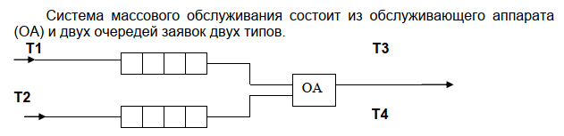
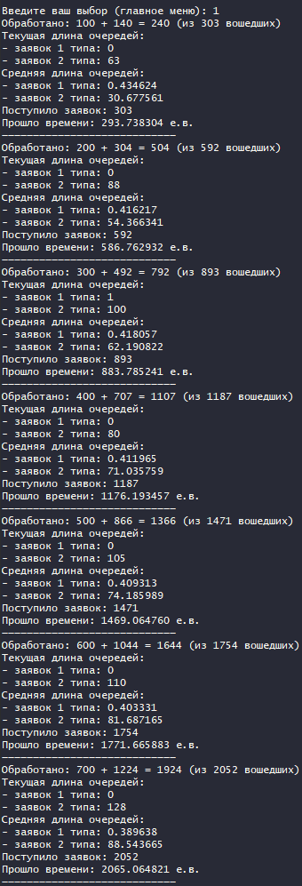
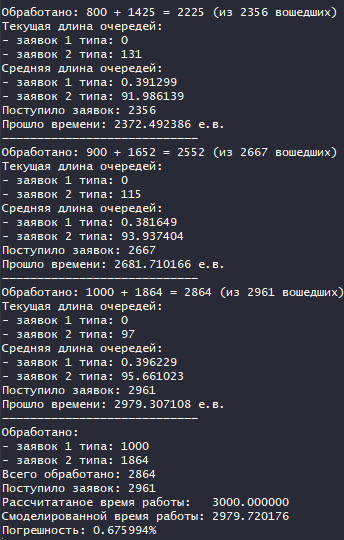
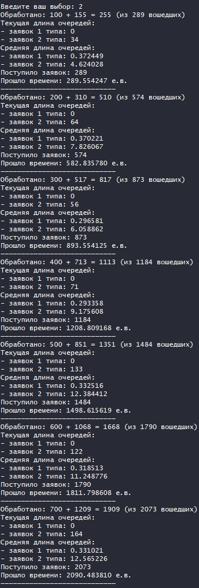
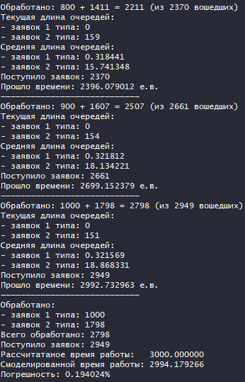
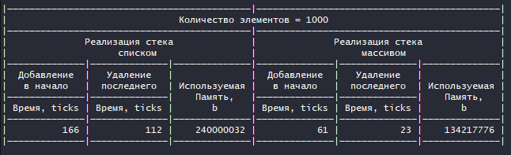

## Введение

### Условие задачи



Заявки  1-го  и  2-го  типов  поступают  в  "хвосты"  своих  очередей  по случайному   закону   с   интервалами   времени `Т1` и `Т2`,   равномерно распределенными от `1` до `5` и от `0` до `3` единиц времени (е.в.) соответственно. В  ОА  они  поступают  из  "головы"  очереди  по  одной  и  обслуживаются  также равновероятно за времена `Т3` и `Т4`, распределенные от `0` до `4` е.в. и от `0` до `1` е.в.  соответственно,  после  чего  покидают  систему.  (Все  времена – вещественного типа). В начале процесса в системе заявок нет.

Заявка 2-го типа может войти в ОА, если в системе нет заявок 1-го типа. Если в момент обслуживания заявки 2-го типа в пустую очередь входит заявка 1-го  типа,  то  она  ждет  первого  освобождения  ОА  и  далее  поступает  на обслуживание (система с **относительным** приоритетом).

Смоделировать  процесс  обслуживания  первых  1000  заявок 1-го  типа. Выдать на экран после  обслуживания  каждых  100  заявок 1-го  типа информацию  о  текущей  и  средней  длине  каждой  очереди,  количестве вошедших  и  вышедших  заявок  и о среднем  времени  пребывания  заявок  в очереди. В конце процесса выдать общее время моделирования и количество вошедших в систему и вышедших из нее заявок обоих типов. По требованию пользователя  выдать  на  экран  адреса  элементов  очереди  при  удалении  и добавлении  элементов.  Проследить,  возникает  ли  при  этом  фрагментация памяти.

## Техническое задание

### Входные данные

Номер команды из меню

### Выходные данные

В зависимости от выбранного действия выходными данными могут являться:

* Результаты моделирования
* Оценка эффективности стандартных операций с очередями, реализованными с помощью массива и списка

## Способ обращения к программе

./app.exe

Выбор одного пункта меню:
* 0 - выход
* 1 - моделирует процесс обслуживания первых 1000 заявок 1-го типа на основе списка
(Адреса добавленных и удаленных заявок будут в файле txt/address.txt)
* 2 - моделирует процесс обслуживания первых 1000 заявок 1-го типа на основе вектора
* 3 - вывод оценки эффективности стандартных функций каждой модели очереди

## Описание внутренних структур данных

```c
// Заявка
typedef struct
{
    size_t id;     // Номер заявки
    void *address; // Адрес заявки
} request_t;
```

```c
// Очередь, реализованная с помощью массива
typedef struct
{
    request_t *buf; // Массив заявок
    size_t max_len; // Максимальная длина очереди
    size_t cur_len; // Текущая длина очереди
    size_t head;    // Номер "головы"
    size_t tail;    // Номер "хвоста"
} queue_array_t;
```

```c
// Описание узла списка
typedef struct node node_t;
struct node
{
    request_t data; // Данные узла (заявка)
    node_t *next;   // Ссылка на следующий элемент узла
};
```

```c
// Структура для хранения очереди, реализованной с помощью списка
typedef struct
{
    node_t *head;   // "Голова" списка
    node_t *tail;   // "Хвост" списка
    size_t cur_len; // Текущаяя длина списка
} queue_list_t;
```

```c
// Интервалы времени поступления и обработки заявок разных типов
typedef struct
{
    double in_time_t1[COUNT];   // Интервал времени, за которое могут поступать заявки типа T1
    double oper_time_t1[COUNT]; // Интервал времени, за которое могут обрабатываться заявки типа Т1
    double in_time_t2[COUNT];   // Интервал времени, за которое могут приходить заявки типа Т2
    double oper_time_t2[COUNT]; // Интервал времени, за которео могут обрабатываться заявки типа Т2
} times_t;
```

## Тесты

| Входные данные             | Результат                                             |
| -------------------------- | ----------------------------------------------------- |
| Выбор первого пункта меню  | Моделирование очереди при помощи списка               |
| Выбор второго пункта меню  | Моделирование очереди при помощи массива              |
| Выбор третьего пункта меню | Оценка эффективности стандартных операций с осередями |

## Расчетное время работы

d1 = (1 + 5) = 6 - Сумма минимального и максимального значений времени прихода заявки первого типа.

d2 = (0 + 4) = 4 - Сумма минимального и максимального значений времени обработки заявки первого типа.

Расчетное время = 1000 *max(d1, d2) / 2 = **3000 е.в.**

## Результаты моделирования

| Моделирование очереди при помощи списка           | Моделирование очереди при помощи массива          |
| ------------------------------------------------- | ------------------------------------------------- |
| </br> | </br> |

## Оценка эффективности стандартных операций с очередями



## Основыне функции

Для очереди-массива:

```c
// Удаление элемента из очереди
int pop_queue_array(queue_array_t *arr, request_t *del);

// Добавление элемента в очередь
void push_queue_array(queue_array_t *arr, request_t *new_elem);

// Увеличение размера массива
void increase_queue_array(queue_array_t *arr);
```

Для очереди-списка:

```c
// Удаление элемента из очереди
int pop_queue_list(queue_list_t *list, request_t *item);

// Добавление элемента в очередь
void push_queue_list(request_t *new_elem, queue_list_t *list);

// Создание узла списка
node_t *node_create(request_t *data);
```

Для расчета ожидаемого времени работы:

```c
// Расчет оживаемого среднего времени работы
double calculate_time(times_t queue, size_t requests_num);
```

Для моделирования обработки заявок очередей:

```c
// Получпение рандомного действительного числа в заданном диапазоне
double random_double(double bottom, double top);

// Моделирование очереди на списке
int model_list_queue(queue_list_t *q_1, queue_list_t *q_2);

// Моделирование очереди на массиве
int model_array_queue(queue_array_t *q_1, queue_array_t *q_2);
```

## Фрагментация памяти

Рассмотрим небольшой блок вывода адресов добавляемых и удаляемых элементов при реализации очереди списком.

```c
Add: 0000000000cc14a8
Del: 000000000068fc38
Add: 0000000000cc14a8
Add: 0000000000cc14c8
Add: 0000000000cc14e8
Del: 000000000068fc38
Add: 0000000000cc14c8
```

Легко заметить, что происходить повторное использование адресов, следовательно, фрагментации нет.

## Вывод

Если известно максимальное количество элементов в очереди, то эффективнее реализовываать очередь при помощи массива, т.к. нам не требуется хранить указатель на следующий элемент, что значительно экономит память.

Если максимальное количество элементов в очереди заранее неизвестно, то оптимальнее, с точки зрения экономии памяти, использовать список.

Стоит обратить внимание, что стандартные операции работы с массивом значительно быстрее аналогичных операций работы со списком (удаление в массиве быстрее в ~4.9 раз, а добавление в 2.7 раза), т.к. нам не требуется каждый раз выделять и освобождать память.

Рассогласование между средними ожидаемыми временами и временами, полученными в моделирующей программе, составляет в среднем ~0.65%.

## Контрольные вопросы

1. Что такое очередь?
   
   Очередь – это последовательный список переменной длины, включение элементов в который идет с одной стороны (с «хвоста»), а исключение – с другой стороны (с «головы»). Принцип работы очереди: первым пришел – первым вышел, т.е. First In – First Out (FIFO)
2. Каким образом, и какой объем памяти выделяется под хранение очереди при различной ее реализации?
   
   При хранении списком память выделяется по одному элементу (при добавлении, вставке). При хранении массивом память выделяется при иницилизации структуры "прозапас" и расширяется по мере необходимости.
3. Каким образом освобождается память при удалении элемента из очереди при ее различной реализации?
   
   При хранении списком память освобождается по одному элементу (при удалении). При хранении массивом память освобождается один раз после завершения работы с очередью.
4. Что происходит с элементами очереди при ее просмотре?
   
   При просмотре очереди элементы последовательно удаляются.
5. Каким образом эффективнее реализовывать очередь. От чего это зависит?
   
  В большинстве случаев эффективнее реализовывать очередь с помощью массива. Зависит от размера очереди и исходной задачи.
6. В каком случае лучше реализовать очередь посредством указателей, а в каком – массивом?
   
   См ответ на вопрос 5.
7. Каковы достоинства и недостатки различных реализаций очереди в зависимости от выполняемых  над ней операций?
   
   - Недостатки:
     - при реализации обычным массивом (не кольцевой структуры) при удалении элемента необходимо сдвигать весь массив
     - при реализации массивом (в том числе кольцевой структурой) у очереди есть верхняя граница, т.е. необходимо со временем расширять массив
     - при реализации списком затрачивается дополнительная память на указатели и время на выделение памяти под новый элемент, освобождение его.
   - Достоинства:
     - при реализации массивом кольцевой структуры добавление и удаление элементов очень быстрое (просто меняются указатели на начало или конец)
     - при реализации списком используется память без запаса
8.  Что такое фрагментация памяти?
   
    Фрагментация – процесс появления незанятых участков в памяти.
9.  На что необходимо обратить внимание при тестировании программы?
    
    Необходимо обратить внимание на переполнение очереди при реализации массивом кольцевой структурой, а также на расхождения расчетного времени и времени моделирования.
10. Каким образом физически выделяется и освобождается память при динамических запросах?
    Программа запрашивает у ОС страницу виртуальной памяти. Далее стандартная библиотека в этой виртуальной памяти, по запросу пользователя резервирует блок памяти нужного размера. Способ резервирования и освобождения зависит от реализизации.
