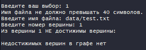
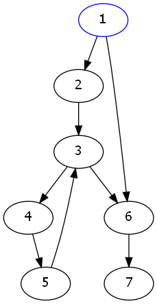
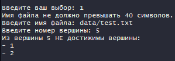
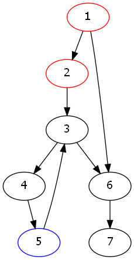
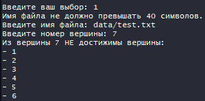
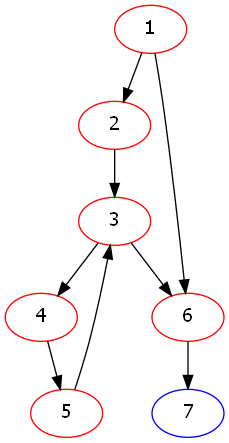

## Введение

### Условие задачи

Найти все вершины заданного opграфа, недостижимые из заданной его вершины.

## Техническое задание

### Входные данные

* Номер команды из меню
* Имя файла
* Номер вершины

### Выходные данные

* Количество недостижимых вершин из заданной вершины
* Иллюстрация

## Способ обращения к программе

./app.exe

Выбор одного пункта меню:

* 0 - выход
* 1 - найти все вершины заданного opграфа, недостижимые из заданной его вершины

## Описание внутренних структур данных

```c
// Матрица
typedef struct
{
    size_t rows; // Количество строк
    size_t cols; // Количество столбцов
    int **data;  // Буффер с данными
} matrix_t;
```

```c
// Орграф
typedef struct
{
    size_t num;                 // Количество вершин графа
    matrix_t *adjacency_matrix; // Матрица смежности
    matrix_t *reachability;     // Матрица достижимости
} graph_t;
```

## Описание алгоритма

Матрица достижимости - сумма степеней матрицы смежности от 1 до n, где n - количество вершин графа.

<!---$$B = \sum^{n}_{i=1} {A^i} $$ --->

1. Дважды копируем матрицу смежностей для временной и результирующей таблиц
2. В цикле n - 1 раз:
   * Умножаем временную таблицу на таблицу смежности
   * Добавляем получившуюся временную таблицу к результирующей

## Основные функции

```c
// Создание графа из файла
graph_t *create_graph_from_file(FILE *file);

// Создание матрицы достижимости
void create_reachability_matrix(graph_t *graph);

// Суммирование матриц
matrix_t *addition(matrix_t *mtx_1, matrix_t *mtx_2);

// Умножение матриц
matrix_t *multiplication(matrix_t *mtx_1, matrix_t *mtx_2);

// Поиск недостижимых вершин
void find_points(graph_t graph, size_t point);
```

## Тесты

| Входные данные                              | Результат                                                  |
| ------------------------------------------- | ---------------------------------------------------------- |
| Несуществующия команда меню                 | Сообщение "Число было введено неверно. Попробуйте еще раз" |
| Выбор команды 1 </br> data/test.txt </br> 1 |  </br>                    |
| Выбор команды 1 </br> data/test.txt </br> 5 |  </br>                    |
| Выбор команды 1 </br> data/test.txt </br> 7 |  </br>                    |

## Вывод

Для поиска недостижимых вершин строилась матрица достижимости. Данный способ поиска имеет ряд преимуществ и недостатков.

Преимущества:

* Данные получаются сразу для всех вершин орграфа

Недостатки:

* Требуется много памяти
* Построение занимает продолжительное время

Таким образом, данный способ поиска недостижимых вершин эффективен для графов небольших размеров.

## Контрольные вопросы

1. Что такое граф?
   
    Граф – конечное множество вершин и соединяющих их ребер; 
    
    $G = <V, E>$. 
    
    Если пары Е (ребра) имеют направление, то граф называется ориентированным; если ребро имеет вес, то граф называется взвешенным.
2. Как представляются графы в памяти?
   
   С помощью матрицы смежности.
3. Какие операции возможны над графами?
   
   Обход вершин, поиск различных путей, исключение и включение вершин.
4. Какие способы обхода графов существуют?
- Обход в ширину 
- обход в глубину

5. Где используются графовые структуры?
   
   Графовые структуры могут использоваться в задачах, в которых между элементами могут быть установлены произвольные связи, необязательно иерархические.
6. Какие пути в графе Вы знаете?
   
   Эйлеров путь, простой путь, сложный путь, гамильтонов путь.
7. Что такое каркасы графа?
   
   Каркас графа – дерево, в которое входят все вершины графа, и некоторые (необязательно все) его рёбра.